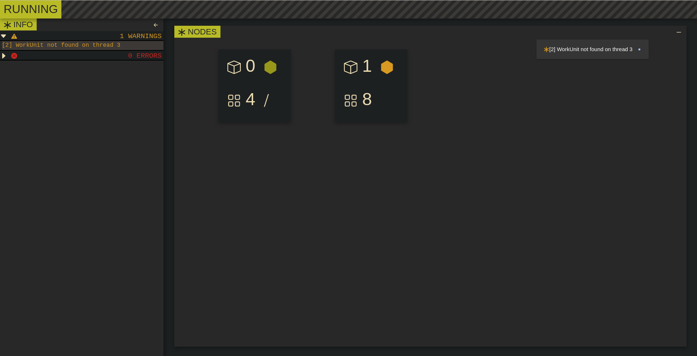

# go-panchaea
The simpliest Golang cluster ever

Panchaea uses RPC and Go Plugins to run your code on different machines. There is no need in packages or other complex calls - just write your code and Panchaea will import it as a plugin. Here's the sample server code - just make sure the structure is the same, because Panchaea works with the reflection of your code.

```golang
var Timeout time.Duration

type Result struct {
	...
}

type WorkUnit struct {
	...
}

type Server struct {
	Current       int      // Current client
	PrepareAmount int      // Amount of WUs to be generated
	WorkUnits     [][]byte // List of prepared WUs, stored in JSON
	Custom        []byte   // Custom server data, stored in JSON
}

func (s *Server) Init() {
	...
}

func (s *Server) Run(id int) ([]byte, error) {
	...
}

func (s *Server) Prepare(amount int) error {
	...
}

func (s *Server) Process(res [][]byte) error {
	...
}

func GetServer() interface{} {
	return &Server{}
}

```

That's it! As for the code to be completed on the node, it sould read bytes from stdin, convert them to JSON and also return bytes as the result.

## Also, Panchaea has a nice web interface:


